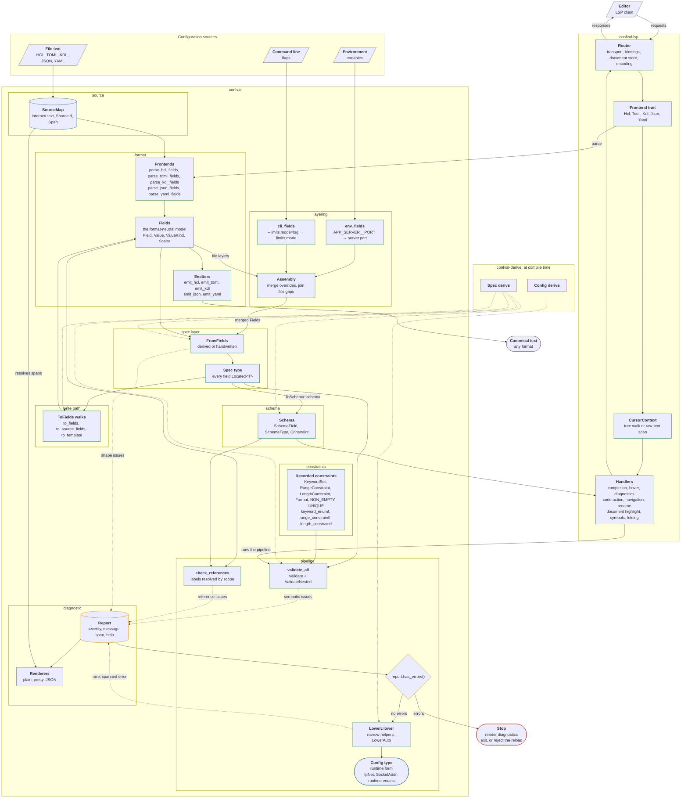
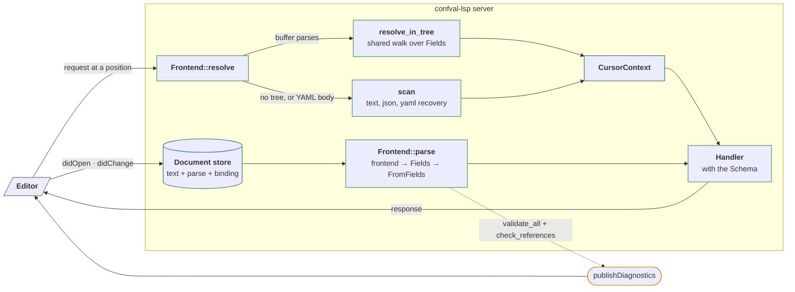

# Architecture

The [pipeline contract](./pipeline.md) details the high-level confval stages.
This page gives a deeper look into confval's internals.
When you contribute to confval or embed it in a larger system, you need the full dependency map and the module boundaries this page describes.

## The three crates

| Crate            | Runs                  | Role                                                                                                       |
|------------------|-----------------------|------------------------------------------------------------------------------------------------------------|
| `confval`        | At runtime            | The field model, the format frontends and emitters, the pipeline, diagnostics, the schema IR, and layering |
| `confval-derive` | At compile time       | The `Spec` and `Config` derives, which generate the trait impls the pipeline needs                         |
| `confval-lsp`    | In the editor session | The schema-generic language server core, built from the same model, pipeline, and schema                   |

The `confval` package also ships a `confval` binary.
The binary installs the agent skills and parses no configuration.
[Agent Skills](./agent-skills.md) covers it.

## The full map

This map shows the regions, the traits, and the functions that carry each step.
Inside `confval` the module dependency direction is strictly downward.
`pipeline` builds on `format` and `schema`.
`constraints` builds on `schema`, `diagnostic`, and `source`.
`pipeline` and `constraints` do not import each other.
`format` builds on `diagnostic`.
`diagnostic` builds on `source`.
`layering` builds on `format`.
`schema` depends on no other module.

The approach is inspired by ["Parse, don't validate"](https://lexi-lambda.github.io/blog/2019/11/05/parse-don-t-validate/) by Alexis King, though it does not use newtypes to couple construction with validation.
The pipeline as a whole acts as a multi-pass parser over a set of in-memory intermediate representations of the configuration.

Each section below describes one region of the map and links to the guide page that covers it in depth.

## Sources and spans

The `source` module records where each value came from.
A `SourceMap` interns each file or in-memory string once and issues a `SourceId` for it.
A `Span` is a `SourceId` plus a byte range.
A `Located<T>` pairs a parsed value with its `Span`.
Every field on a spec therefore knows where it came from.

Spans are plain data.
After parsing, no stage reads source text until a renderer resolves a span at render time.
[Diagnostics](./guide/diagnostics.md#spans-and-source) covers the types.

## The format-neutral field model

The `format` module is the boundary between text and the rest of the system.
A frontend parses one format into `Fields`, one level of named entries.
Each `Field` carries its name span, its entry span, and a `FieldKind` of `Value` or `Block`.
A `Value` pairs a span with a `ValueKind`.
The kinds are a `Scalar`, a sequence, a map, and an out-of-model `Other`.
After a frontend runs, no later stage knows which format the text came from.

The same model flows in both directions.
The emitters render a `Fields` back to canonical text in any format.
A configuration can therefore be read in one format and written in another.
Each frontend and emitter pair sits behind a cargo feature.
A build carries only the formats it enables.
[Parsing](./guide/parsing.md#the-field-model) describes the model, and [Format Limitations](./guide/format-limitations.md) lists what falls outside it.

## Layering

The `layering` module assembles one configuration from several sources.
A file provider such as `parse_toml_fields`, the `env_fields` provider, and the `cli_fields` provider each return a `Fields` layer.
Environment and command line values enter as `Unparsed` scalars.
The field's declared type decides what the text becomes.

`Assembly` folds the layers in call order.
`merge` lets a later layer override, and `join` fills only what is missing.
`FromFields` runs once on the merged result.
A layered spec and a single-file spec are therefore the same type.
[Layering](./guide/layering.md) covers precedence and the providers.

## The spec layer

`FromFields::from_fields` builds a spec type out of a `Fields` level.
The `Spec` derive generates the impl for a plain struct.
A handwritten impl covers shapes such as tagged unions.

The parse checks structure only.
A missing field, a wrong type, a duplicate, and an unknown field each become a spanned issue in the report.
The parse continues after each one.
Every field on the spec is a `Located<T>`.
The inner type is the rawest type that parses infallibly.
[Parsing](./guide/parsing.md) covers the derive and the handwritten path.

## Validation and the gate

`validate_all` runs the spec's `Validate` rules and descends through `ValidateNested` into every nested block.
The recorded constraints, `KeywordSet` and `RangeConstraint`, run inside that pass for a derived spec.
The `keyword_enum!` and `range_constraint!` macros declare those two types.

`check_references` is separate.
It reads the whole parsed tree and the schema rather than one level's own fields.
Every rule appends spanned issues to the report and never panics.

The gate is a caller-side check.
Call `report.has_errors()` and stop before lowering when it is true.
[Validation](./guide/validation.md) and [Lowering](./guide/lowering.md) cover the two stages.

## Lowering

`Lower::lower` narrows the validated spec into the runtime config type with the `narrow` helpers.
A lowering error is rare.
It short-circuits instead of accumulating, and it indicates a missing validation rule rather than invalid input.

## The write path

A spec walks back out through `ToFields`.
`to_fields` fills every default and detaches spans, producing the populated view and the input to format conversion.
`to_source_fields` keeps only the fields whose spans are attached, producing the source view.
`to_template` adds each field's doc comment, producing the annotated template.

All three produce a `Fields`.
The ordinary emitters render each of them in any format.
Each format renders the comments its syntax allows, and JSON renders none.
A handwritten spec lists its fields once through `FieldsBuilder`, which takes the walk as a parameter.
[Representations](./guide/representations.md) and [Templates](./guide/templates.md) cover the views, and [Parsing](./guide/parsing.md#writing-emitters-by-hand) covers the builder.

## The schema IR

`ToSchema::schema` reads the spec type rather than a value.
It needs no instance.
The `Schema` tree carries each field's name, doc comment, `required` flag, default text, and declared `SchemaType`.
The recorded constraints appear as `Constraint::Keywords`, `Constraint::Range`, and `Constraint::References`.

Two consumers read it.
`check_references` resolves labels against it, and the language server answers each editor request from it.
[Schema IR](./guide/schema-ir.md) covers the node types and the reference scoping rule.

## Diagnostics

Every stage writes into one `Report`.
An issue records a severity, a message, an optional span, an optional help line, and related spans.
The renderers resolve spans through the `SourceMap` only at render time: as one line per issue, as rustc-style excerpts, or as JSON.
[Diagnostics](./guide/diagnostics.md) covers the builder and the renderers.

## The derives

`confval-derive` runs at compile time and generates the impls the map shows as dashed arrows.
The `Spec` derive writes `FromFields`, the three `ToFields` walks, `ToSchema`, the `ValidateNested` descent, and the checks for recorded constraints.
The `Config` derive writes `Lower`, with an exhaustive destructure of the spec.
A field added on one side without the other is a compile error.
The generated `Lower` impl carries a `Validate + ValidateNested` bound.
A spec without a validator does not compile.

## The language server

`confval-lsp` is three layers over erased bindings.
A binding pairs one root spec's schema and validate pass with a frontend.
The `Router` serves one binding per document shape.
One process can therefore serve a multi-document configuration.

1. The transport shell owns the `lsp-server` connection, the bindings, the document store, and the position encoding. It routes each document to a binding at open.
2. The `Frontend` trait is the one format-dependent boundary, with an implementation per format.
3. The pure handlers each compute one answer from the document, the schema, and a resolved cursor context.

A frontend parses through the same confval frontend your program uses.
The diagnostics the editor shows are the ones the program would raise.

Position resolution has two paths.
A buffer that parses resolves through one shared walk over the `Fields` tree.
A buffer that does not parse resolves through raw-text scanners for the brace, header, object, and indentation syntaxes.

[Language Server](./guide/language-server.md) covers how to run one, and [Editor Support](./guide/editor-support.md) covers what the editor does with it.
